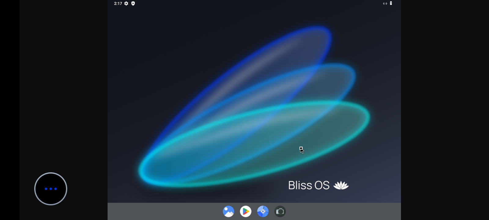

---

# Qemu-Vortax V 2.0

Run any operating system (ISO, QCOW2, or compressed archive) directly on **GitHub Actions** with full graphical access through **RDP**, **VNC** (Password Protected) and **NoMachine** Via **Tailscale** and **Ngrok**. Preserve your VM disk using **Automatic MEGA Upload**.

            

---

## ⚙️ Overview

**Qemu-Vortax V 2.0** is an educational and experimental workflow that boots complete virtual machines inside GitHub Actions using QEMU + XFCE.
You can run Linux distributions, Android builds, or pre-made cloud images (ISO/QCOW2) from any source.

> 🧠 For educational use only.
> The author holds no responsibility for bans, data loss, or misuse.
> Use entirely **at your own risk**.

> 🛑 **Encountering an issue or error?** Please refer to the **[Official Troubleshooting Guide](https://github.com/qemuvortax/Qemu-Vortax/blob/main/Help-Troubleshoot.md)** for immediate solutions to common problems.

> 💬 **Can't find your issue?** If the guide doesn't cover your problem, feel free to **[contact me directly via my official Bot](https://t.me/YourOfficialBotLink)** for personalized support.

---

## 🚀 Features

- 🔒 **NEW: VNC Password Protection:** Secure your session with a custom VNC password.
- 💾 **NEW: QCOW2 Persistence:** Automatically uploads the final disk image to a **self-generated MEGA account** after runtime, ensuring data persistence.
- 🧩 Supports `.iso`, `.qcow2`, `.zip`, `.7z`, `.rar`, `.tar`, `.tar.gz`
- 💻 XFCE desktop accessible via RDP, VNC, or NoMachine
- 🛰️ Private encrypted tunnel through Tailscale or Ngrok
- 📦 Automatic decompression for archives
- 🔁 Preset OS templates ready to boot
- 🧠 **IMPROVED:** Strict mode auto-detects based on `boot_mode` selection.
- 👾 Fixable choice between UEFI and BIOS
- ⏱️ Runtime limiter to control session length
- 🌐 Cross-device access (Windows, macOS, Linux, Android)
- 💾 Temporary QCOW2 storage for realistic disk simulation
- ⚡ Boots in under 4–5 minutes depending on image size

---

## 🛠️ Usage Guide

### 1. Fork the repository
Click **Fork** on the project page.

### 2. Add your Auth Keys
Go to **Settings → Secrets → Actions → New repository secret** and add the following:

- Name: `TAILSCALE_AUTHKEY`
  Value: your Tailscale key

- Name: `NGROK_AUTH`
  Value: your Ngrok authtoken

> ☁️ **MEGA Upload Note:** MEGA account details are generated dynamically and displayed in the final logs. No secrets are needed for the upload process.

### 3. Run the workflow
1. Open the **Actions** tab.
2. Select **Qemu-Vortax V 2.0**.
3. Click **Run workflow** and fill the inputs.

---

## 🧾 Inputs (Updated for V 2.0)

| Input | Description | Example |
|-------|--------------|----------|
| `system_choice` | Pre-set OS to run | `mint`, `ubuntu`, `kali`, `deepin` |
| `boot_mode` | Boot type (`iso` or `qcow2`) | `qcow2` |
| `source_url` | Custom URL (MediaFire, Mega, direct) | `https://example.com/os.iso` |
| `vm_name` | VM name | `test-linux` |
| `runtime` | Session duration in minutes | `335` |
| `connection_method` | `tailscale` or `ngrok` | `tailscale` |
| `connection_program` | `RDP`, `VNC`, `NoMachine` | `VNC` |
| `bios_mode` | Firmware mode (`UEFI` or `BIOS`) | `BIOS` |
| **`vnc_password`** | **Set a password for VNC connection** | `mysecretpass` |
| **`upload_qcow2`** | **Upload QCOW2 file to Mega: yes or no** | `yes` |

> ⚠️ Do not include spaces in URLs 
> The system choice must match the selected `boot_mode` for correct to booting.
> Archives are automatically extracted if supported.
> If you intend to upload the file to Mega after completion, make sure you do not use more than 15 GB of data, as the compressed file may exceed Mega's 20 GB limit.
> If you want to upload a file and you've added files that don't exceed one mega's limit, make sure you have enough time to compress and upload the file. it might take up to 45 minutes before the upload is complete. otherwise you can end up with none unuploaded file

---

## 🧩 Pre-set Systems

| System | Boot Type | Screenshot | Description |
|--------|------------|--------------|-------------|
| `bazite` | ISO |  | Minimal distro focused on performance and clean design. |
| `bliss` | ISO/QCOW2 |  | Android-based OS with Google Apps pre-installed. |
| `centos_qcow2` | QCOW2 | Command Line interface | CentOS Stream 10 GenericCloud image for stable enterprise environments. |
| `cutefish` | ISO |  | CutefishOS 22.04 with a clean macOS-like interface. |
| `deepin` | ISO/QCOW2 |  | Deepin Linux with an elegant UI and strong customization. |
| `garuda_mokka` | ISO |  | Garuda Linux Mokka edition for gaming and speed. |
| `kali` | ISO/QCOW2 |  | Kali Linux for penetration testing and ethical hacking labs. |
| `manjaro` | ISO |  | Manjaro GNOME 25.0.10, a fast and user-friendly Arch-based distribution. |
| `mint` | ISO/QCOW2 |  | Linux Mint XFCE edition for smooth and modern experience. |
| `neon` | ISO |  | KDE Neon with the latest Plasma environment. |
| `pear` | ISO |  | Pear Linux, macOS-style Ubuntu derivative focused on elegance and simplicity. |
| `pop_os` | ISO/QCOW2 |  | Pop!\_OS optimized for developers and creators. |
| `ubuntu` | ISO |  | Classic Ubuntu desktop with XFCE, stable and lightweight. |
| `debian_qcow2` | QCOW2 | Command Line interface | Debian 12 Bookworm cloud image preconfigured for QEMU. |
| `win11` | QCOW2 |  | Windows 11 latest release optimized for security and UI. |
| `win10` | QCOW2 |  | Windows 10 stable release with mainstream app support. |
| `win8.1` | QCOW2 |  | Windows 8.1 with modern UI and improved performance. |
| `win7` | QCOW2 |  | Windows 7 Professional with classic interface and broad software support. |
| `winVista` | QCOW2 |  | Windows Vista with Aero interface and legacy support. |
| `winXP` | QCOW2 |  | Windows XP classic edition, lightweight and legacy software compatible. |

> All previous releases (V1.3, V1.4, V1.5, V1.6, V1.7, V1.8, V1.9) are included as previous released in [Releases](https://github.com/qemuvortax/Qemu-Vortax/releases) folder.

---

## 🖥️ Connection Details

| Type | Address | Tool |
|------|----------|------|
| RDP | `ip:3389` | Remote Desktop Client |
| VNC | `ip:5900` | VNC Viewer / Remmina |
| NoMachine | `ip:4000` | Fast remote desktop |
| Tailscale | secure | Private VPN-style access |
| Ngrok | secure | Private tunnel forward access |

> When connected through RDP or NoMachine, open **Connect_VNC.sh** inside the desktop to view the QEMU display.

---

## ⚡ Performance Tips

- Use `qcow2` for faster subsequent boots.
- Longer runtime = longer session before auto shutdown.
- Avoid huge compressed archives for quicker starts.
- Verify links before running custom sources.
- Make sure not to make run time more than 315 min if you want to upload you qcow2 file after finishing 

---

## ☁️ Data Persistence (MEGA Upload)

When `upload_qcow2` is set to `yes`, the following information will be provided in the final run log after the session ends and the file is uploaded:

1. **MEGA Account Credentials:** (Email and Password for the dynamically generated account)
2. **QCOW2 Download Link:** (The direct link to retrieve your compressed VM disk image)

---

## 🧠 Credits

Developed by **Mohamed Ahmed Saad**
Project: **Qemu-Vortax V 2.0**
Goal: Simplify, secure, and accelerate virtual machine testing in the cloud.

---

## ⚖️ License and Disclaimer

Released under the **MIT License**.
You may use, modify, and redistribute with attribution.

This project is for educational and experimental purposes only.
By running it, you accept full responsibility for any consequences.
